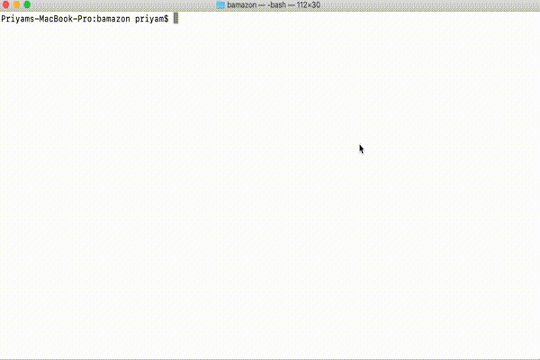
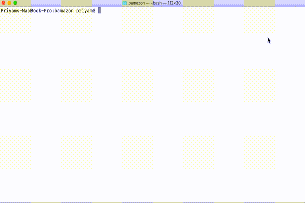

# bamazon

## 1. Problem Statement

 **Bamazon** is an Amazon-like app using MySQL skills that will-

* Take orders from the customers as per the customer id and give them the total purchase cost.
* Help managers to see the stock list of products, add new products to the list, update stock of current products and alert for low stock inventory.
* Help Supervisors see department and their profits, and add new departments to the list.

## 2. Organisation

* **schema.sql**
  * Contains queries to create Bamazon database, products and departments table.
  * Creating and adding columns to the tables

* **seed.sql**
  * Contains queries for adding data/rows to the table

* **bamazonCustomer.js**
  * Contains code the allow the customer to order and purschare products.
  * Gives total purchase price to the customer.
  * Updates the stock quantity in the database

* **bamazonManager.js**
  * Contains code to view product list, stock level and total product sales.
  * Alert products with low stock level
  * Add stock to the existing inventory
  * Add new inventory items to the list

* **bamazonSupervisor.js**
  * Contains code to view product sales by department.
  * Total profits for each department.
  * Add new department to the list.

## 3. Working Commands

To start the app, run 

* *node bamazonCustomer*
  * To sign in as a customer 

* *node bamazonManager*
  * To sign in as a Manager 

* *node bamazonSupervisor*
  * To sign in as a Supervisor 

## 4. Demo

## 5. Technologies Used

### Package dependencies

* **SQL**
* **Inquirer**
* **Chalk**

## 6. Role

This app is completely developed by me.